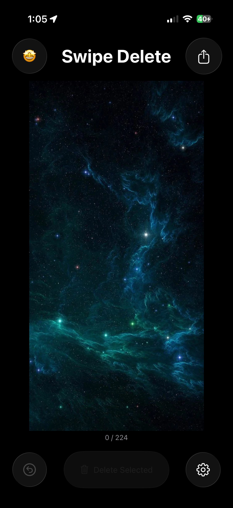
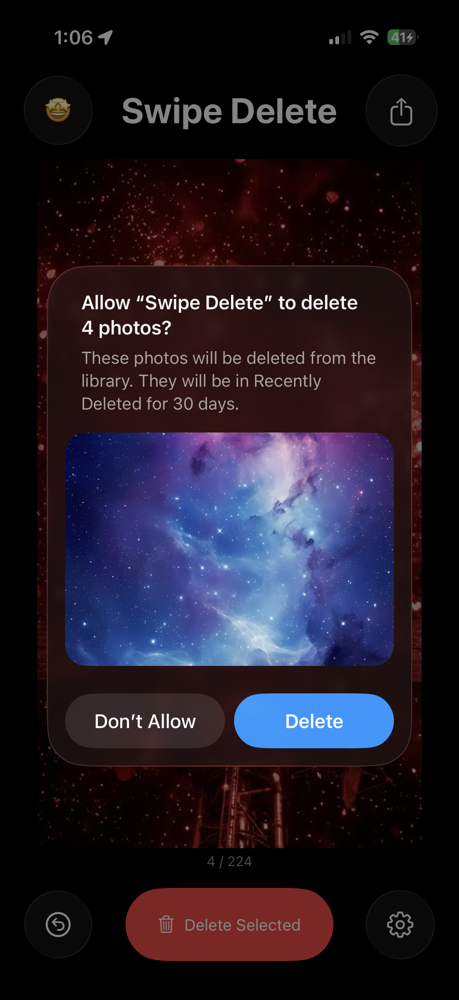
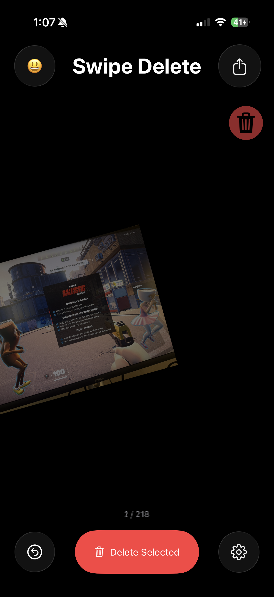
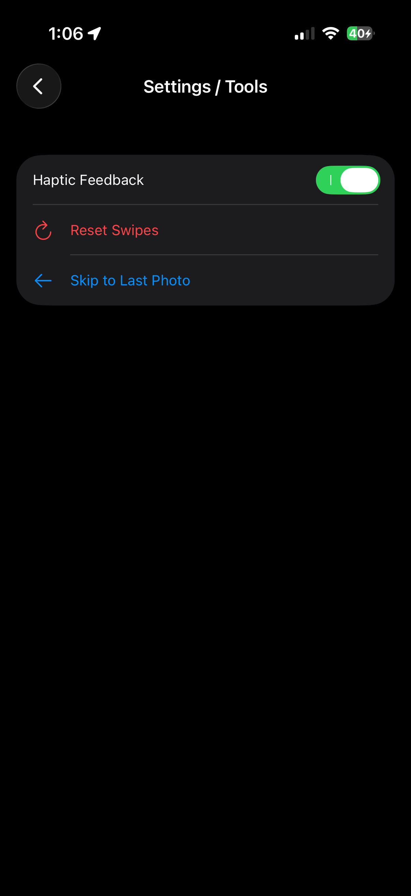

# Swipe Delete

Swipe Delete is a macOS/iOS application designed for managing and deleting media from a photo library.

## Website
A landing page for the application is available in the `website` directory.
- Open `website/index.html` to view.

## Features
- Smart photo selection interface.
- Batch deletion process for rapid library cleanup.
- Configurable settings for library management.
- Visual review system for media identification.

## Screenshots

| Homepage | Delete Dialog | Animation | Settings |
| :---: | :---: | :---: | :---: |
|  |  |  |  |

## Technical Overview
The project is built with Swift and SwiftUI.
- `Delete_PhotosApp.swift`: App entry point.
- `ContentView.swift`: Primary user interface for photo review.
- `SettingsView.swift`: User configuration options.