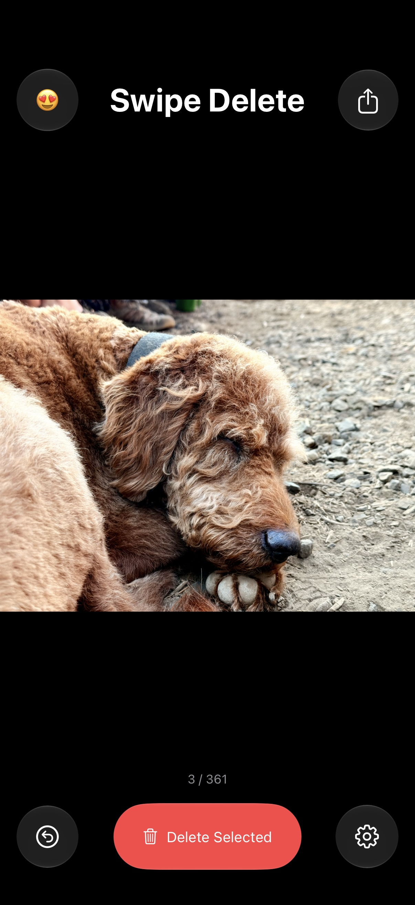
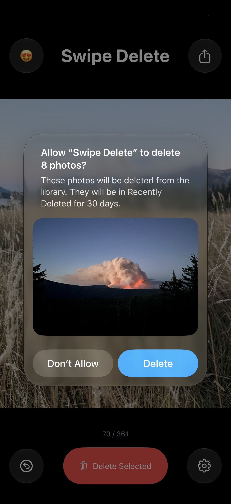
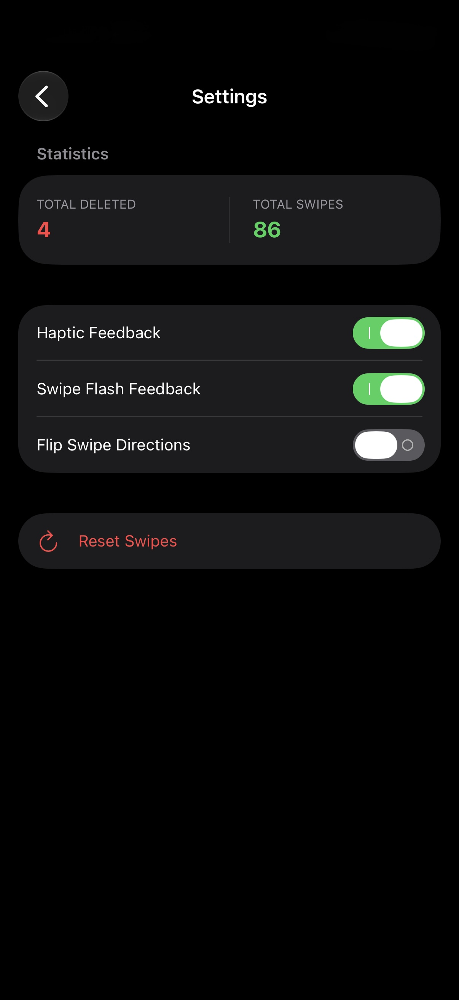

# Swipe Delete

Swipe Delete is an iOS application designed for managing and deleting photos from the photo library.

## Screenshots

| Homepage | Delete Dialog | Settings |
| :---: | :---: | :---: |
|  |  |  |